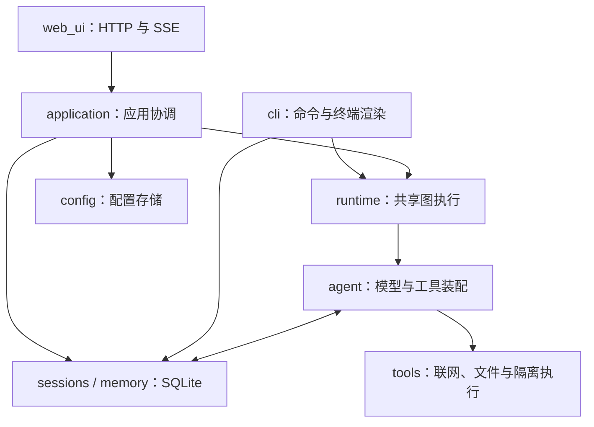

# NUVORA 架构设计 · v0.3.0

NUVORA 是一个使用 LangGraph 的本地 AI 助理。默认网页入口将聊天、模型设置、工具开关、会话、长期记忆和工作区放在同一页面；可选终端入口保留斜杠命令。两种入口使用同一个 Agent 运行时和相同数据库格式。

## 1. 模块边界



| 模块 | 职责 | 边界 |
|---|---|---|
| `web_ui.py` | 本地 HTTP 服务、固定静态资源、Host/Origin/Cookie/CSRF 校验、请求解析、路由与 SSE 编码 | 不读取 SQL、不修改应用内部锁、不组装 Agent、不保存配置 |
| `application.py` | `AgentApplication` 协调用户操作；`Turn` 拥有回合、流和取消信号 | 不依赖 HTTP 状态、Cookie、请求对象或浏览器 |
| `config.py` | 类型化配置、加载与环境覆盖、`ConfigStore` 快照/草稿/脱敏视图、原子保存 | 调用方得到独立配置对象，不能通过读操作修改运行配置 |
| `sessions.py` | `SessionRepository` 管理检查点访问、标题、排序与旧会话 | SQL 和数据库连接生命周期集中管理，不负责消息展示 |
| `runtime.py` | `AgentRuntime` 执行图，输出 `RuntimeEvent`，修复中断检查点 | 不写 HTTP，不打印终端，不持有应用锁 |
| `messages.py` | 消息文本提取和网页展示投影 | 网页与终端使用同一文本规则 |
| `errors.py` | 参数、忙碌、关闭、不存在等应用错误 | HTTP 入口映射为 400/409/503/404，核心层不携带状态码 |
| `agent.py` | LangChain `create_agent` 装配、提示词和检查点工厂 | 工具只构建一次，提示词使用同一份工具列表 |
| `memory.py` | 事务化 SQLite 长期记忆和记忆工具 | 用内部锁保护完整操作，支持重复关闭 |
| `llm.py` | OpenAI 兼容模型工厂、模型发现、连接测试、自检和错误脱敏 | 运行时可注入模型工厂；测试不依赖真实云端密钥 |
| `tools/` | 联网、工作区文件、Python 隔离、时间和系统工具 | 工作区路径由调用方注入，工具开关决定实际装配能力 |
| `cli.py` | Rich 渲染、斜杠命令、终端主循环和子命令 | 使用共享运行时和会话仓库，不维护第二套图执行循环 |

`web_ui.WebApplication` 作为 `AgentApplication` 的兼容导入保留。启动入口和现有 `/api/*` 路由保持兼容，`static/` 页面无需了解核心模块划分。

## 2. 回合与资源生命周期

网页每个应用实例同一时刻只允许一个运行回合。`begin_turn()` 在应用锁内校验输入、会话、模型和空闲状态，记录标题并生成独立配置快照，然后返回 `Turn`。

HTTP 入口使用 `with app.begin_turn(body) as turn`。回合自己拥有事件迭代器和取消信号，退出上下文时先关闭执行流，再释放占用。未开始迭代、客户端断开、序列化失败和迭代器关闭异常都经过同一清理路径。关闭是幂等的，结束回合按对象身份匹配，旧回合无法释放新回合。

应用锁仅覆盖配置、元数据和状态切换；模型调用、模型探测以及 HTTP 写响应在锁外进行。探测接口先取得配置草稿，网络请求期间仍能读取状态或停止当前回合。数据库仓库和长期记忆分别维护自身的事务锁；SqliteSaver 维护检查点读写锁。

构造应用和仓库时使用 `ExitStack` 注册数据库清理，后续初始化失败会关闭已经打开的连接。应用关闭时设置取消信号并拒绝新操作；仍有回合时，数据库延迟到回合退出后关闭。终端退出和初始化失败使用相同的资源清理约定。

占用控制属于单个应用实例，SQLite 的 WAL/busy timeout 处理其他连接的数据库争用；这不提供跨进程的回合互斥。

## 3. 图执行与中断恢复

1. 入口取得本回合配置与模型，将工作区、记忆、检查点和 thread_id 交给 `AgentRuntime`。
2. `agent.build_agent` 按开关装配工具，将同一工具列表的名称写入系统提示词，调用 `create_agent`。
3. LangGraph 恢复会话，追加本次用户消息。模型给出回答或工具调用；工具结果作为 `ToolMessage` 回到模型，直到结束或达到轮数限制。
4. 运行时输出完整消息事件；需要文字流时额外订阅 `messages` 模式输出 token。网页编码成既有 `start/token/tool_start/tool_result/done/stopped/error` SSE 事件，终端渲染完整消息。
5. 网页关闭“流式输出”时保留 `updates` 流，以便仍能在 Agent 步骤之间停止；终端非流式模式使用 `invoke`，完成后渲染本次新增消息。

取消信号在图流的步骤边界检查。已经发出的模型请求或工具可能先完成；停止不保证立刻杀死所有请求，也不回滚已发生的文件或记忆写入。

停止、断流、模型错误或终端 KeyboardInterrupt 后，运行时在关闭图流后读取 `get_state`，包含尚在 `pending_writes` 的结果。仅处理最新用户消息之后的最后一次模型步骤：

- 最后模型消息含工具调用：保留该步骤已完成的结果，为未应答调用补充取消记录，并从 `tools` 节点提交。
- 最后模型消息为普通回答：从 `model` 节点提交该回答，不重放历史工具结果。
- 模型还没有生成消息：保留当前检查点。

修复后的持久历史供网页、终端和下一回合共同读取。修复是尽力操作，数据库自身发生故障时仍保留原始异常，不用修复错误覆盖它。

## 4. 配置与持久数据

配置优先级依次为非空 `NUVORA_BASE_URL` / `NUVORA_API_KEY` / `NUVORA_MODEL`、`config.toml`、示例配置和内置默认值。模型地址必须是无内嵌凭据的 HTTP/HTTPS URL；类型、温度、轮数、超时和结果数都有校验。

`ConfigStore` 通过深拷贝提供快照和草稿。草稿用于未保存的模型发现与连接测试；保存设置在验证环境变量覆盖后，通过同目录临时文件、fsync 和原子替换更新磁盘，成功后才更换内存配置。POSIX 文件权限为 0600。配置文件损坏时页面允许修复，原始内容先备份到被 Git 忽略的 data 目录。

配置读取只返回密钥是否存在。输入空密钥表示保留原值，`clear_api_key: true` 才清除。运行回合使用独立快照；保存的设置应用到下一回合，执行期间拒绝设置和工作区/记忆写操作。

| 路径 | 内容 | 兼容性 |
|---|---|---|
| `config.toml` | 私密模型设置与工具/记忆/流式开关 | 原 TOML 分组不变，不提交 Git |
| `data/checkpoints.db` | SqliteSaver 图检查点，按 thread_id | 原 CLI 和网页检查点直接使用 |
| `data/interface.db` | sessions 表：id、title、updated | 原表不变；旧检查点无标题时补充展示名称 |
| `data/memory.db` | 长期事实：id、时间、内容、标签、thread_id | 原表不变，记忆开关不删除存储 |
| `workspace/` | 用户文件与 Python 可写工作区 | 路径不变，生成文件不提交 Git |

会话列表按全部 thread_id 的最新检查点聚合，不扫描有限数量的消息。仓库合并标题表与旧检查点，空的新会话也能在重启后找到。终端临时模型覆盖仍按 thread_id 保存，开启新会话不继承另一个会话的覆盖。

关闭长期记忆后，Agent 不装配记忆工具、不注入已存信息；页面手动管理记忆继续可用。网页手动工作区操作不依赖 Agent 文件工具开关。

## 5. 执行边界

本地 HTTP 服务只监听 `127.0.0.1`。Host/Origin 校验、随机 SameSite/HttpOnly Cookie、写请求 CSRF Token 和 Sec-Fetch-Site 检查由传输层负责。限制 JSON 请求大小和读取超时，静态资源使用固定映射；CSP 禁止外部脚本和嵌入，前端通过安全 DOM 操作显示内容。应用层只返回脱敏配置；模型异常使用对应配置脱敏。

文件工具拒绝绝对路径、盘符、空路径、NUL 和 `..`，解析路径后验证仍在真实工作区。POSIX 逐层使用目录句柄并拒绝跟随被替换的符号链接，写入以同目录临时文件原子替换。读取只允许普通文件并限制到 20K 字符，目录限制 1000 项，工具文本写入限制 100 万字符；页面写入限制 40000 字符，被截断内容不能直接覆盖保存。

Python 仅在 Linux/WSL 的 bubblewrap 0.9+ 与 libseccomp 隔离可用时执行，没有无隔离回退。工作区可写，运行时和必要系统库只读；其他宿主目录不挂载。用户、PID、网络、IPC、挂载命名空间隔离，移除 capabilities，seccomp 拒绝 socket、io_uring、挂载、ptrace 等调用。解释器使用 `-I -B` 和固定环境白名单，不继承密钥、代理或用户环境。

Python 默认 30 秒、上限 120 秒；限制 CPU、每进程 512 MiB 地址空间、32 MiB 单文件、文件描述符和进程数，临时目录 64 MiB。有界输出持续排空管道，超时清理进程组和执行后代。这不是整个任务的总资源或工作区总磁盘配额。隔离不可用时工具返回不可用，其余功能继续工作。

## 6. 验证与扩展

```bash
python -m unittest discover -s tests -v
python smoke_test.py
python -m pip check
```

回归使用真实 Agent 图和 SQLite，覆盖工具循环、重开、历史恢复、并发记忆与回合占用、文件路径与链接竞态、配置隔离和原子保存失败、启动清理、断流清理、停止后继续、HTTP 来源/CSRF 和错误脱敏。本地 OpenAI 兼容模拟端点验证实际 ChatOpenAI 的发现、连接和流式链路；不代表真实云端提供商验收。系统禁止命名空间时实际 Python 隔离测试会标明原因并跳过；HTTP 测试不代表浏览器交互与视觉验收。

新增界面可调用 `AgentApplication`，复用回合上下文；新增模型协议在 `llm.py` 或注入模型工厂；新增工具在 `tools/` 和注册表装配；向量记忆可替换 `LongTermMemory` 检索实现。扩展不应在 HTTP 路由中加入 SQL、模型装配或独立会话执行循环。
