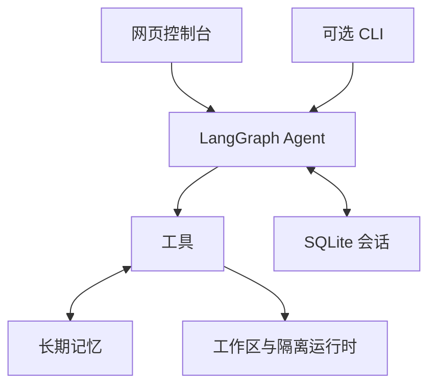

# NUVORA 架构设计文档

> **NUVORA** = **Nova**（新星）+ **Ora**（时刻）——「此刻升起的新星」
> 一个基于 LangGraph 的通用 AI 智能助理 · v0.2.0

---

## 1. 项目概述

### 1.1 定位

NUVORA 是一个运行在用户终端（WSL）里的**通用 AI 智能助理**：

| 能力 | 说明 |
|---|---|
| 对话 | 流式（逐消息）渲染，支持多会话、跨重启恢复 |
| 联网 | DuckDuckGo 搜索 + 网页正文提取 |
| 文件 | 在 `workspace/` 沙箱内读写文件、浏览目录 |
| 代码 | 执行 Python 片段（子进程 + 超时控制） |
| 记忆 | 会话检查点（短期）+ SQLite 长期记忆（跨会话） |
| 模型 | 任意 OpenAI 兼容端点，用户完全自定义，支持自动探测 |

### 1.2 设计原则

1. **模型无关**：NUVORA 不绑定任何一家模型厂商。任何提供 OpenAI 兼容接口的服务（智谱、DeepSeek、Moonshot、OpenRouter、Ollama、vLLM……）都能即插即用。
2. **少依赖、可读**：核心代码千行级，每个模块职责单一，适合阅读和二次开发。
3. **安全默认值**：文件沙箱、代码超时、key 不落日志，安全边界宁紧勿松。
4. **无 key 可运行**：除真实对话外，所有功能（配置、工具、记忆、自检）都可以在没有 API key 的情况下验证。

---

## 2. 调研依据（2026-10）

设计前对当前主流方案做了联网调研，结论：

| 调研点 | 结论 | 来源 |
|---|---|---|
| 框架选型 | LangGraph 以显式状态机架构成为生产级首选，长期维护的代码库中表现更好；OpenAI Agents SDK 更轻但绑定 OpenAI 生态 | [AI framework comparison 2026: LangChain vs LangGraph](https://www.yaitec.com)、[Agent Frameworks in 2026: Choosing the Right Runtime](https://suparious.com)、[Best AI Agent Frameworks in 2026](https://hirehal.ai)、[AI Agent Framework Comparison 2026](https://jangwook.net) |
| 核心循环 | ReAct（Thought → Action → Observation）+ 工具调用是当前最可靠的 agent 模式 | [Build a Simple ReAct Agent from Scratch](https://cognitiveclass.ai)、[ReAct Pattern](https://hopx.ai)、[I Built 100+ Gen AI Agents](https://dev.to) |
| 记忆 | 分层记忆是共识：工作记忆（上下文窗口）/ 情景记忆（会话日志）/ 语义记忆（长期知识库）；纯向量库不等于记忆 | [Memory Systems for AI Agents](https://agentcogito.com)、[Memory Is Not a Vector Database](https://dev.to)、[Long-term Memory in LLM Applications (LangMem)](https://langchain-ai.github.io) |
| 工具协议 | MCP（Model Context Protocol）是工具接入的事实标准，正向 agent-to-agent 演进；接入时需做安全边界（白名单、最小权限、审计） | [MCP Guide](https://www.buildmvpfast.com)、[MCP Security Best Practices: 2026 Checklist](https://www.swfte.com)、[MCP 2026 Roadmap](https://www.elegantsoftwaresolutions.com) |
| 模型接入 | OpenAI 兼容接口已成行业默认；智谱 GLM 等国产端点均支持 Function Calling 与 `/models` 风格列表 | [智谱开放平台文档](https://docs.bigmodel.cn)、[GLM API Guide](https://apidog.com) |

---

## 3. 总体架构



### 3.1 一次对话的完整数据流

1. 用户在网页或 CLI 输入文本 → 界面以 `("user", text)` 追加到消息列表，按当前 `thread_id` 调用 `agent.stream()`。
2. LangGraph 从 SqliteSaver 恢复该会话的历史状态，执行 **agent 节点**：把系统提示词 + 全部历史 + 本次消息发给模型。
3. 模型要么直接回答（循环结束），要么发起 `tool_calls` → **tools 节点**执行对应工具 → 观察结果作为 `ToolMessage` 回到 agent 节点 → 重复，直到模型给出最终回答或达到 `recursion_limit`。
4. 每一步的状态变更都写入 SqliteSaver；网页/CLI 渲染过程消息（工具调用面板、结果面板）与最终回答（Markdown）。

---

## 4. 模型接入层

### 4.1 配置模型（三层优先级）

1. **环境变量**：`NUVORA_API_KEY` / `NUVORA_BASE_URL` / `NUVORA_MODEL`（最高）
2. **config.toml**（网页保存；也可手动填写）
3. **内置默认值**（仅 base_url 有默认——智谱端点；key/model 必填否则无法对话）

### 4.2 模型发现协议

`nuvora models` / `/models` 向 `{base_url}/models` 发起 GET（带 Bearer 头），解析标准 OpenAI 格式 `{"data": [{"id": ...}]}`，同时兼容 `{"models": [...]}` 与纯字符串数组。失败时优雅降级：提示该端点可能不支持列表，引导手填模型名。

`nuvora doctor --ping` 用 `max_tokens=1` 的真实请求验证对话链路（key 有效性、模型名、端点路径一次性排查）。

### 4.3 为什么用 ChatOpenAI 而不是各家专用 SDK

OpenAI 兼容接口已是 2026 年的行业默认。`langchain_openai.ChatOpenAI(base_url=...)` 一套代码覆盖几乎所有主流与本地端点，避免为每个厂商维护适配器。专用 SDK（如 Anthropic 原生协议）作为后续扩展点。

---

## 5. 工具系统

### 5.1 工具清单

| 工具 | 功能 | 安全措施 |
|---|---|---|
| `web_search` | DuckDuckGo 搜索（ddgs，免 key） | 异常转字符串回给模型，不炸循环 |
| `web_fetch` | 抓网页 + trafilatura 提取正文（Markdown） | 仅 http/https；8KB 截断 |
| `list_dir` / `read_file` / `write_file` | 文件浏览/读取/写入 | **路径沙箱**（见 5.2）；读取 20K 字符截断 |
| `run_python` | 子进程执行 Python | 见 5.3 |
| `current_time` / `system_info` | 时间与环境信息 | 只读 |
| `remember` / `recall` / `forget` | 长期记忆增删查 | 仅操作 memory.db |

### 5.2 文件沙箱实现

`resolve_in_sandbox()` 是唯一的路径入口：

1. 统一斜杠，拒绝绝对路径、Windows 盘符、空路径和 NUL；`.` 表示工作区根目录；
2. **拒绝任何含 `..` 的路径**；
3. `resolve()` 解析符号链接后，再校验目标仍在 `workspace/` 真实根内；
4. POSIX 下通过目录句柄逐层打开、不跟随被替换的链接；覆盖写入使用同目录临时文件及原子替换；
5. 读取只接收普通文件、最多读取 20K 字符；目录结果最多 1000 项，单次文本写入最多 100 万字符。

沙箱根 = 项目目录下的 `workspace/`，与代码目录隔离。

### 5.3 Python 执行隔离

`run_python` 只在 Linux/WSL 的 bubblewrap + libseccomp 隔离成功建立后执行代码；没有无隔离回退。
工作区作为 `/workspace` 挂载并可写，Python 运行时和必要系统库只读，其余宿主目录不挂载。
用户、PID、网络、IPC、挂载等命名空间隔离，禁止创建新的用户命名空间，移除 capabilities；seccomp 额外拒绝 socket、io_uring、挂载、ptrace 等系统调用。
解释器使用 `-I -B`；固定环境白名单不包含密钥、代理和用户环境变量。默认 30 秒、上限 120 秒；每个进程限制 CPU、512 MiB 地址空间、32 MiB 单文件大小、文件描述符及进程数量；临时目录 64 MiB。
输出管道持续排空，只保留有限字节。外层进程组清理与隔离 PID 命名空间共同结束执行后代。
这些限制不是工作区总磁盘配额或整个任务的总资源配额。系统不支持隔离时，工具明确返回不可用；doctor 和测试显示对应状态。

### 5.4 工具错误处理约定

所有工具**不抛异常**，把失败信息以字符串返回（`搜索失败：TimeoutError: ...`）。这让模型能读到失败原因并自行调整策略（换关键词、换路径、告知用户），符合 ReAct 的观察-再推理模式。

---

## 6. 记忆系统（三层）

| 层 | 存储 | 生命周期 | 实现 |
|---|---|---|---|
| 工作记忆 | 上下文窗口 | 单回合 | 由模型上下文长度决定；`recursion_limit` 防失控 |
| 情景记忆（会话） | `data/checkpoints.db`（SqliteSaver） | 跨重启，按 thread_id | LangGraph 检查点，每步自动持久化；`/sessions`、`/resume` 管理会话 |
| 语义记忆（长期） | `data/memory.db`（memories 表） | 永久 | 结构：`(id, created_at, content, tags, thread_id)`；关键词 LIKE 检索；每回合把最近 12 条注入系统提示词 |

**长期记忆的写入策略**：由模型自主判断——系统提示词指示「用户透露值得长期记住的信息（背景/偏好/项目/决定）时调用 remember」。这是当前主流的 agent 自主记忆模式；未采用向量检索的原因：原型阶段关键词检索足够、零额外依赖，升级路径明确（见 §10）。

---

## 7. 安全设计

| 威胁 | 缓解 |
|---|---|
| 路径逃逸读写任意文件 | 路径校验 + POSIX 目录句柄/no-follow + 原子替换 |
| 代码执行越界/失控 | bubblewrap + seccomp；固定环境；资源限额；超时清理后代；有界输出 |
| API key 泄漏 | key 仅在内存与 config.toml；doctor 输出打码（`sk-1****abcd`）；不写日志 |
| 提示词注入放大 | 工具输出以 ToolMessage 形式参与推理，敏感操作（删记忆需编号、写文件需明确意图）由系统提示约束 |
| 失控循环烧 token | `recursion_limit` 硬上限（默认 30 轮工具调用） |

仍可扩展：按会话配置工具权限、工作区总磁盘配额、MCP 接入认证与审计。

### 7.1 SQLite 和会话一致性

长期记忆以 `RLock` 覆盖完整读写操作，写入通过 SQLite 事务提交或回滚；WAL 和 busy timeout 处理其他连接的争用。
会话列表按 SQLite 中的 thread_id 聚合最新检查点，恢复按 thread_id 直接查询，不再受最近 200/500 条检查点的扫描限制。
模型临时覆盖按当前 thread_id 保存；`/new` 不继承另一个会话的覆盖。退出时关闭两类数据库连接。

---

## 8. 目录结构与模块职责

```
AI AGENT/
├── DESIGN.md / README.md      文档
├── requirements.txt           依赖（langgraph / langchain / langchain-openai /
│                              langgraph-checkpoint-sqlite / ddgs / trafilatura / rich / httpx）
├── config.example.toml        配置模板（复制为 config.toml 填 key）
├── smoke_test.py              10 项冒烟测试（无 key 可跑）
├── workspace/                 文件工具沙箱根
├── data/                      运行时生成：checkpoints.db + memory.db
└── nuvora/
    ├── __init__.py            名称/版本/系统提示词模板
    ├── config.py              TOML 加载 + 环境变量覆盖 + 校验
    ├── llm.py                 ChatOpenAI 工厂、/models 探测、doctor、ping
    ├── agent.py               create_agent 组装 + 系统提示词拼装（人格/环境/记忆块）
    ├── memory.py              LongTermMemory（SQLite）+ 记忆工具工厂
    ├── tools/
    │   ├── __init__.py        工具注册表：build_tools(cfg, memory) → list[BaseTool]
    │   ├── web.py             web_search / web_fetch
    │   ├── files.py           沙箱路径解析 + 文件三件套
│   ├── python_repl.py     run_python_code
│   ├── _python_sandbox.py bubblewrap/seccomp 与执行管道
    │   └── system.py          时间 / 环境信息
    ├── cli.py                 ChatSession（流式渲染 + 斜杠命令）+ doctor/models 子命令
    └── __main__.py            python -m nuvora 入口
```

**配置速览**（完整注释见 `config.example.toml`）：

| 字段 | 默认 | 说明 |
|---|---|---|
| `[model] base_url` | 智谱端点 | 任意 OpenAI 兼容地址 |
| `[model] api_key` / `model` | 空 | 必填才能对话 |
| `[model] temperature` | 0.7 | 采样温度 |
| `[agent] max_iterations` | 30 | 单回合工具调用轮数上限 |
| `[tools] python_timeout` | 30 | 代码执行超时（≤120） |
| `[memory] enabled` | true | 长期记忆开关 |
| `[cli] stream` | true | 逐消息流式渲染 |

---

## 9. 测试与验收

**冒烟测试**（`smoke_test.py`，10 项，无 API 消耗）：
配置加载 → 默认根目录及文件读写 → 路径逃逸拦截 → 记忆增查删 → 记忆工具链 → run_python 执行/超时/异常（隔离不可用时明确跳过）→ 不可达端点降级 → 真实离线 Agent 工具循环和 SQLite 写入 → 提示词完整性 → 依赖完整性。

`python -m unittest discover -s tests -v` 还验证真实数据库重开恢复、20 个并行记忆工具、480 次并发写入、600 个新检查点后的旧会话恢复、符号链接替换竞态、原子写入失败、无隔离拒绝执行、环境清理、输出限长及后代超时终止。实际 Python 隔离测试在宿主禁止命名空间时跳过，并注明原因。

**真实对话验收**（需 key）：`doctor --ping` 通过 → CLI 对话 → 让它搜索并写文件 → 重启后 `/sessions` + `/resume` 恢复 → `记住…` 后新会话验证长期记忆生效。

---

## 10. 扩展路线

| 方向 | 说明 | 改动点 |
|---|---|---|
| Token 级流式 | `stream_mode="messages"` 逐字输出 | 仅 cli.py 渲染层 |
| 向量长期记忆 | 记忆检索换 embedding + SQLite-vss/Chroma | memory.py |
| MCP 接入 | 以 MCP client 身份接入外部工具 server | tools/ 新增 mcp.py |
| 子代理 | 复杂任务拆分给专职子 agent（LangGraph 多节点） | agent.py |
| Web UI | FastAPI + 前端，复用 ChatSession | 新增 server.py |
| 语音 | ASR/TTS 包一层 | cli.py |
| 原生协议适配 | Anthropic/Google 专用 SDK | llm.py 工厂加分支 |


## 统一网页界面（v0.2.0）

默认入口改为本地网页，原 CLI 由 chat 子命令保留。标准库 ThreadingHTTPServer 仅监听 127.0.0.1；本地 HTML/CSS/JS 提供三栏控制界面，无新增 Web 框架依赖或 CDN。Windows/Linux 启动器首次准备虚拟环境，之后直接打开浏览器。

web_ui.WebApplication 使用现有 Agent、SqliteSaver 与 LongTermMemory，并以 interface.db 保存会话标题；已有 CLI 检查点通过原 thread_id 恢复。模型配置经过类型、范围与地址校验后原子保存到 config.toml，POSIX 上文件权限为 0600，读取接口仅返回密钥是否已设置。错误配置可在页面修复，原文件先保存到被 Git 忽略的 data 目录。

配置与工具开关应用到下一次对话，运行中的回合拒绝修改设置。messages/updates 流经 SSE 返回文字和工具结果；停止信号在流的检查点处理，已启动的请求/工具可能先完成。中断后合并 pending_writes 中的结果和取消记录，避免界面历史与下一回合的工具上下文不一致。

联网、文件和 Python 开关持久化在 tools 分组；长期记忆开关关闭时不向 Agent 装配记忆工具或注入已存信息。页面手动管理记忆与工作区不依赖 Agent 的工具开关。文件界面复用既有路径限制与原子写入；被截断的读取结果不能直接保存。

接口检查 Host、Origin、SameSite/HttpOnly 会话 Cookie 和写请求的随机 CSRF Token；限制请求大小，静态文件仅使用固定路径映射，内容使用 textContent/安全 DOM 节点显示。默认 CSP 禁止外部脚本与嵌入；模型密钥不会进入浏览器配置响应。

验证包含真实 HTTP 服务、真实 Agent 图与本地 OpenAI 兼容模拟端点，覆盖保存/重开、老会话、工具执行、停止后恢复、记忆与文件操作、密钥脱敏和跨站请求拒绝。浏览器交互与视觉验证受执行环境限制时需单独记录，不能把 HTTP 测试描述为实际浏览器验收。
